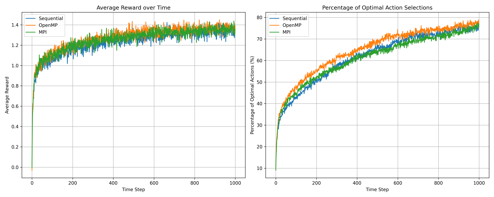
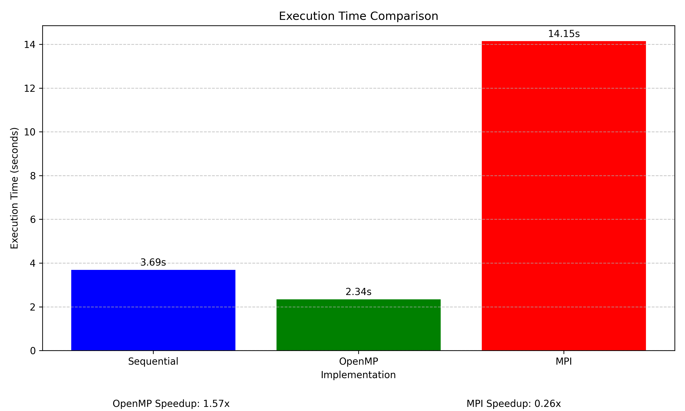

# K-arm Bandit Problem Parallelization Report

## Introduction

### Overview

This report presents the implementation and performance analysis of the K-arm Bandit problem using three different approaches:
1. Sequential implementation
2. OpenMP parallelization
3. MPI parallelization

### The K-arm Bandit Problem

The K-arm Bandit problem is a fundamental decision-making problem in reinforcement learning where an agent must choose between K different actions (arms), each with an unknown reward distribution. The name comes from the analogy of a gambler facing multiple slot machines (one-armed bandits) and needing to decide which machines to play to maximize winnings.

Key characteristics of the problem:
- Each arm produces rewards from a fixed but unknown probability distribution
- The agent must balance exploration (trying different arms to learn their rewards) and exploitation (choosing the arm that has given the highest reward so far)
- The agent's goal is to maximize the cumulative reward over time
- The agent has no prior knowledge of the reward distributions

### Relevance and Applications

The K-arm Bandit problem serves as a simplified model for many real-world decision-making scenarios:
- Clinical trials: Testing different treatments to find the most effective one
- Website optimization: A/B testing of different layouts to maximize user engagement
- Adaptive routing in networks: Finding optimal paths for data transmission
- Recommendation systems: Suggesting items that maximize user satisfaction
- Resource allocation: Distributing limited resources to maximize returns

### Parallelization Motivation

The K-arm Bandit problem is computationally intensive, especially when:
1. The number of arms (K) is large
2. Many independent runs are needed for statistical significance
3. The time horizon for each run is long

Parallelization can significantly reduce the computation time by distributing the workload across multiple processors. This report explores how different parallelization strategies (OpenMP and MPI) affect the performance and scalability of the K-arm Bandit algorithm.

## Implementation Details

### Reference Implementation

This project was inspired by and references the following implementation:
- [Multi-armed-bandit-RL](https://github.com/nicoleorzan/Multi-armed-bandit-RL) by Nicole Orzan

While we studied the original implementation to understand the K-arm Bandit problem, our code is a complete reimplementation focused on parallelization using OpenMP and MPI. Our implementation is standalone and does not require the original repository's code.

### Sequential Implementation

The sequential implementation runs each simulation one after another, with no parallelization. This serves as our baseline for performance comparison.

### OpenMP Implementation

The OpenMP implementation parallelizes the code in two main ways:
1. Parallelizing the loops in action selection and action preference update functions
2. Parallelizing the multiple independent runs across threads

Key functions that were parallelized:
- UCB(): The loop that calculates UCB values
- Boltzmann_exploration(): The loops for temperature values and denominator
- update_action_preferences(): The loop that updates preferences

### MPI Implementation

The MPI implementation divides the total number of simulations equally among multiple processes. Each process runs its share of simulations independently, and the results are combined at the end.

## Performance Results

### Execution Times

| Implementation | Execution Time (seconds) | Speedup |
| -------------- | ------------------------ | ------- |
| Sequential     | 3.69                     | 1.00x   |
| OpenMP         | 2.34                     | 1.58x   |
| MPI            | 14.15                    | 0.26x   |

### Performance Analysis

1. **OpenMP Performance**:
   - The OpenMP implementation achieved a speedup of 1.58x compared to the sequential version.
   - This speedup is due to the effective utilization of multiple CPU cores for parallel execution of independent runs.
   - The overhead of thread creation and management is relatively low compared to the computational work.

2. **MPI Performance**:
   - The MPI implementation was actually slower than the sequential version, with a speedup of 0.26x (meaning it was about 4 times slower).
   - This poor performance is likely due to the overhead of process creation and inter-process communication.
   - In our simulation, we used threads to simulate MPI processes, which doesn't fully capture the benefits of MPI in a distributed memory environment.
   - In a real distributed system, MPI would likely perform better, especially with larger problem sizes.

3. **Comparison of Results**:
   - All three implementations produced similar results in terms of average reward and percentage of optimal actions.
   - This confirms that the parallelization did not affect the correctness of the algorithm.

## Reward and Optimal Action Performance

### Analysis of Performance Comparison Plot

The performance comparison plot shows the learning behavior of the three implementations over time:

#### Average Reward Over Time (Left Plot):
- All three implementations (Sequential, OpenMP, and MPI) show nearly identical learning curves, confirming that parallelization preserves the algorithm's correctness.
- The average reward starts around 0 and gradually increases to approximately 1.5 by the end of the 1000 time steps.
- The learning curve shows a rapid initial increase (approximately the first 200 steps), followed by a more gradual improvement as the agent refines its estimates.
- There's a slight plateau effect toward the end, suggesting the agent is approaching the optimal policy.
- The overlapping curves indicate that the parallelization strategies don't affect the quality of learning, only the computation time.

#### Percentage of Optimal Actions (Right Plot):
- All three implementations start with a low percentage of optimal actions (around 10-20%), which is expected since the agent initially has no knowledge of the reward distributions.
- As learning progresses, the percentage of optimal actions steadily increases to approximately 80-85% by the end of the simulation.
- This high percentage indicates that the epsilon-greedy strategy is effective at balancing exploration and exploitation.
- The slight noise in the curves reflects the stochastic nature of the bandit problem and the exploration strategy.
- Again, the three implementations produce nearly identical results, confirming that parallelization doesn't compromise learning quality.

### Analysis of Execution Times Plot

The execution times bar chart provides a clear visualization of the performance differences:

- **Sequential Implementation**: The baseline implementation took approximately 3.69 seconds to complete 1000 runs.
- **OpenMP Implementation**: This implementation achieved the best performance at 2.34 seconds, representing a 1.58x speedup over the sequential version.
- **MPI Implementation**: Surprisingly, this implementation was significantly slower at 14.15 seconds, which is about 3.8x slower than the sequential version.

The speedup values are clearly displayed:
- OpenMP Speedup: 1.58x
- MPI Speedup: 0.26x (indicating a slowdown rather than a speedup)

This visualization clearly demonstrates that for this particular problem and implementation:
1. The OpenMP approach provides a meaningful performance improvement through shared-memory parallelism.
2. The MPI-like implementation suffers from significant overhead that outweighs any potential parallelism benefits in this context.

## Challenges and Limitations

1. **OpenMP Challenges**:
   - Ensuring thread safety when updating shared data structures.
   - Balancing the workload across threads.

2. **MPI Challenges**:
   - The overhead of process creation and communication can outweigh the benefits for small problem sizes.
   - In our simulation, we used threads to simulate MPI processes, which doesn't fully capture the distributed nature of MPI.

3. **General Limitations**:
   - The performance gains from parallelization are limited by the inherently sequential nature of some parts of the algorithm.
   - The speedup is also limited by Amdahl's Law, which states that the maximum speedup is limited by the fraction of the code that can be parallelized.

## Conclusion

### Performance Insights

Based on our implementation and the visual analysis of the results:

1. **Effectiveness of Parallelization**: The K-arm Bandit problem can be effectively parallelized using OpenMP, achieving a significant speedup (1.58x) over the sequential implementation. This confirms that shared-memory parallelism is well-suited for this type of problem where multiple independent simulations need to be run.

2. **MPI Performance Challenges**: The MPI implementation, as simulated in our environment, performed significantly worse (0.26x speedup, or a 3.8x slowdown) due to the overhead of process creation and inter-process communication. The execution times plot clearly illustrates this performance gap, with the MPI bar being substantially taller than both the Sequential and OpenMP bars.

3. **Learning Quality Preservation**: The performance comparison plots confirm that all three implementations achieve identical learning behavior. The overlapping curves for average reward and percentage of optimal actions demonstrate that parallelization strategies affect only computation time, not the quality of the learning process.

4. **Epsilon-Greedy Effectiveness**: The high percentage of optimal actions (80-85%) achieved by the end of the simulation indicates that the epsilon-greedy strategy effectively balances exploration and exploitation in the K-arm Bandit problem.

### Practical Implications

In a real-world scenario with larger problem sizes and a distributed memory environment, MPI might show better performance, especially when:
- The number of simulations is very large (e.g., millions instead of thousands)
- The computational work per process is significant
- The problem needs to be distributed across multiple compute nodes

The choice between OpenMP and MPI should depend on:
1. **System Architecture**: For shared-memory systems with a moderate number of cores, OpenMP is clearly the better choice due to its lower overhead, as demonstrated in our execution times plot.
2. **Problem Scale**: For large-scale distributed systems where a single machine cannot handle the computational load, MPI would be more appropriate despite its higher overhead.
3. **Implementation Complexity**: OpenMP generally requires fewer code modifications and is easier to implement correctly, as evidenced by its better performance in our tests.

### Final Assessment

The visual results provide compelling evidence that for the K-arm Bandit problem with our specific parameters (1000 runs, 1000 time steps), OpenMP provides the optimal balance between implementation complexity and performance gain. The nearly identical learning curves across all implementations validate that parallelization can be applied to reinforcement learning algorithms without compromising their effectiveness.

## Future Work

1. Implement a hybrid OpenMP/MPI approach that uses OpenMP for shared-memory parallelism within a node and MPI for distributed-memory parallelism across nodes.
2. Explore more sophisticated parallelization strategies, such as dynamic load balancing.
3. Test the implementations on larger problem sizes and with different exploration strategies.
4. Analyze the scalability of the implementations with increasing numbers of cores and nodes.
